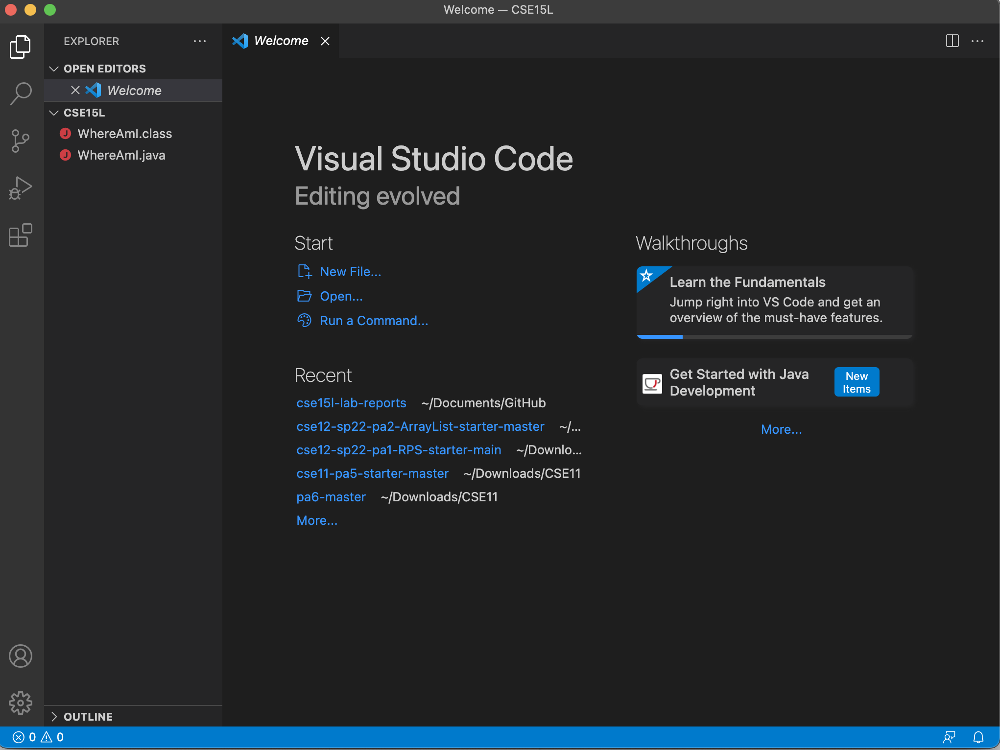
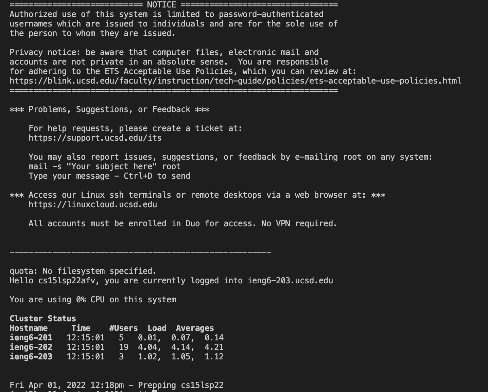
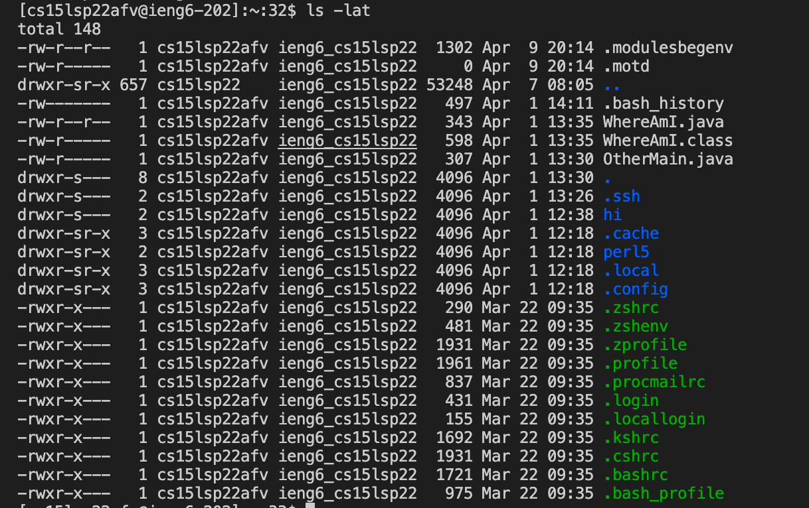
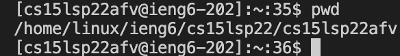
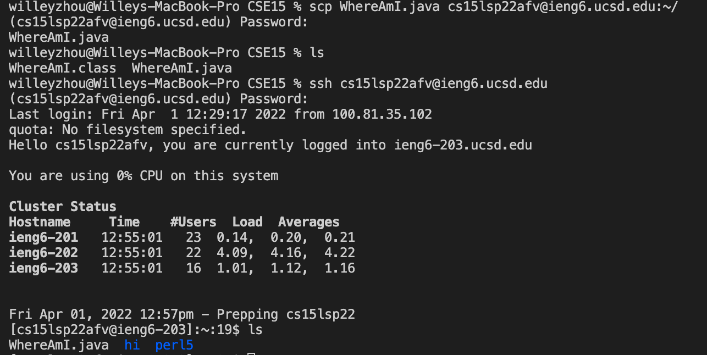
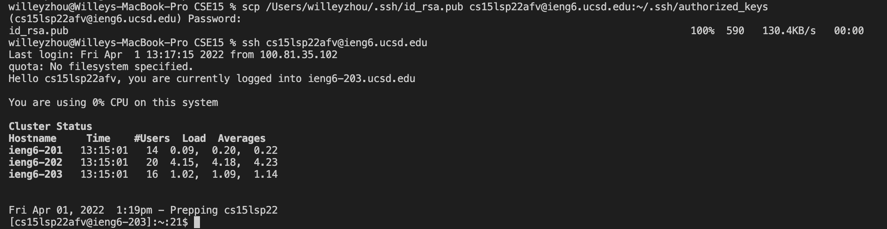
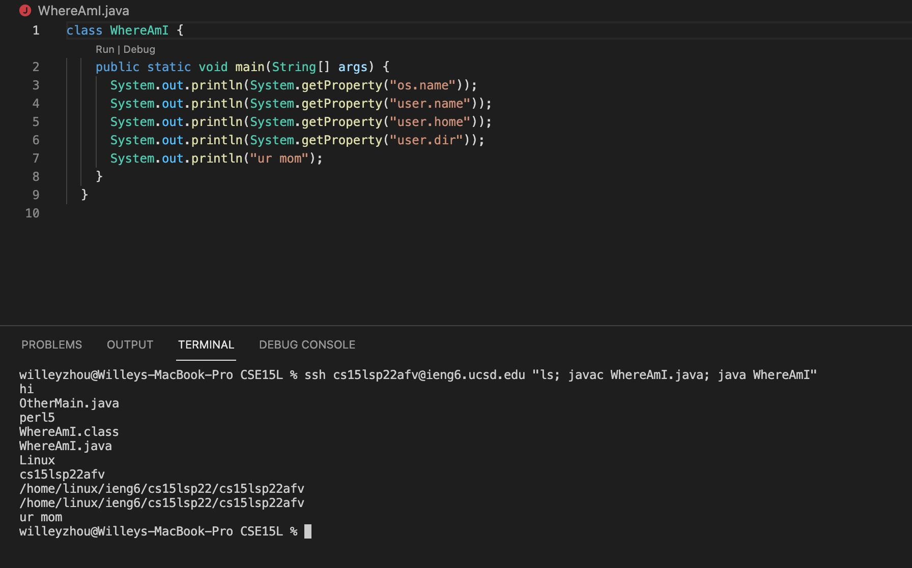

# How to log into a course-specific account on ieng6
__1. Install VSCode.__ VSCode is what you will use in order to run the commands necessary to log into ieng6. You do this by downloading VSCode through their website. After downloading and opening it, you should see a screen similar to the bottom:

__2. Remotely Connecting.__ To do this, we use the ssh command; for the CSE15L class, I would run the command `$ ssh cs15lsp22zz@ieng6.ucsd.edu` (but "zz" is replaced with the letters in my course specific account). After logging in using your account password, as seen below, this is roughly what it should look like when you are logged in (but without the "Notice" section).

__3. Trying Some Commands.__ After logging in to the remote computer, there are certain commands that do certain actions. For example, the `ls -lat` command shows the folders in the server, as shown below:

Another example is the `pwd` command, which shows all of the current directories you are in:

__4. Moving Files with SCP.__ Using the command `scp`, we have the ability to move files from our local computer onto the remove server. The picture below shows how after using `scp`, the file `WhereAmI.java` can be seen in the remote server:

__5. Setting an SSH Key.__ By using the `ssh-keygen` command, you can create a key which allows you to log into the remote server without having to constantly enter your password. After you create the key file, use `mkdir .ssh` in the remote server and use the `scp` command seen in the picture below to copy the public key to the .ssh directory of your account on the server. After doing these steps, you will be able to log into the server without using a password.

__6. Optimizing Remote Running.__ There are certain shortcuts you can use in order to use less time doing the same commands. You can put quotations marks around a command after writing `ssh` to run the command in the server (E.g: `ssh cs15lsp22afv@ieng6.ucsd.edu "ls -lat"`), or use semicolons in order to run multiple commands at once. The picture below shows these two concepts:

_And that's about it!_ These are a few tips into connecting to a remote server and managing it.