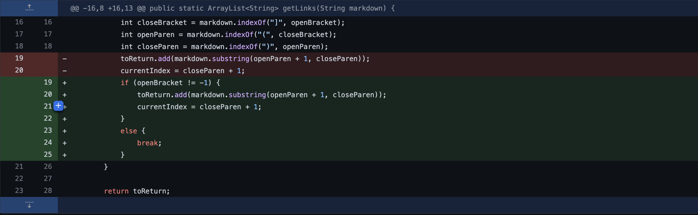
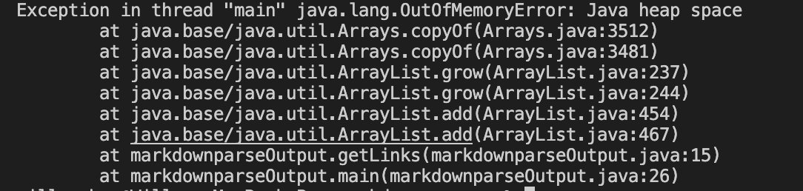
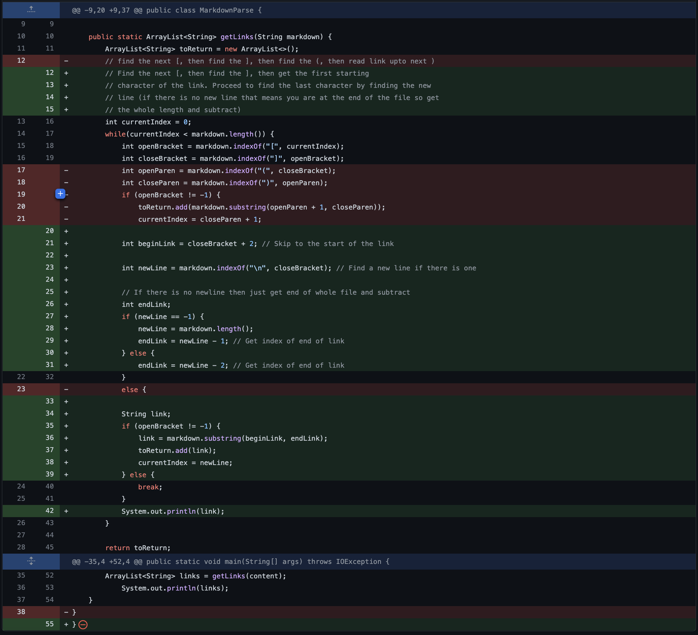
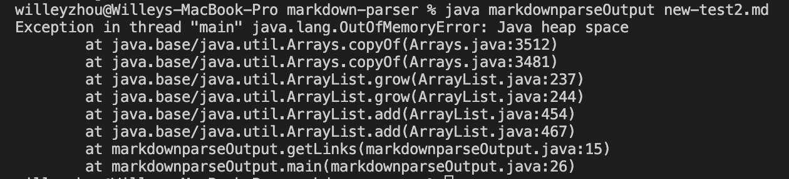
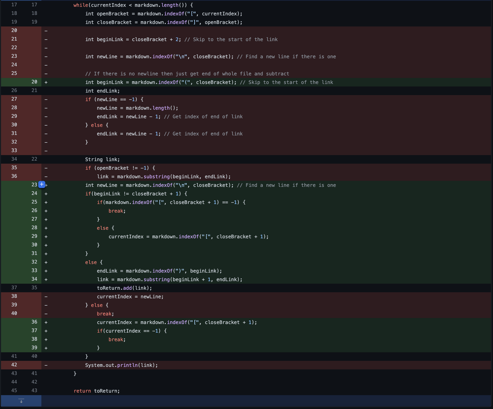
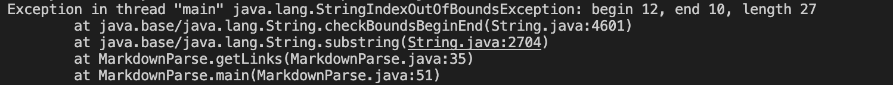

# Three Code Changes

__Change #1:__

__[Link to test file with error 1](https://github.com/willersss/markdown-parser/blob/main/new-test.md)__

Before making the change, the original code did not account for empty lines, therefore making the while loop run infinitely. Because of this, the ``OutOfMemoryError`` error was printed.

__Change #2:__

__[Link to test file with error 2](https://github.com/willersss/markdown-parser/blob/main/new-test2.md)__

Before making this change, the original code would stop at an index after trying to find the next bracket after stopping at the first parentheses. ``CurrentIndex`` would then stay at a value less than ``markdown.length()``. Due to this problem, the while loop would loop infinitely and give the ``OutOfMemoryError`` error message.

__Change #3:__

__[Link to test file with error 3](https://github.com/willersss/markdown-parser/blob/main/new-test3.md)__

This error happens because the beginning of the link in the previous code is set to ``closeBracket + 2`` and the ending of the link is set to the end of the line. If the ``closeBracket`` is the end of the line, it sets up the contraction where the index of the beginning is larger than the index of the end, therefore printing the ``StringIndexOutOfBoundsException``.