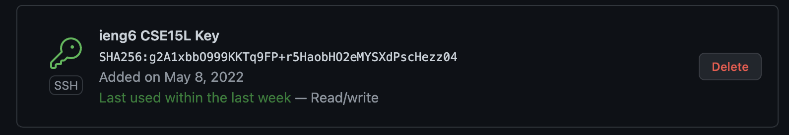
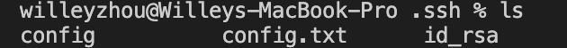
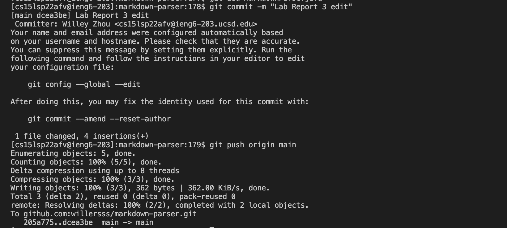

# Streamline SSH Configuration
In order to configure my SSH Login, I first created a config file and added the following text to it:

After completing this, I was able to log into the remote server by simply typing in `ssh ieng6` into the terminal, shown below:

I could now use commands using `ieng6` instead of typing in my entire login. For example, I demonstrate the usage of `scp` with `ieng6` below:

# Setup Github Access from ieng6

To do this, I copied my public key and added it to GitHub:

The private key can be seen in my ssh folder:

After doing this, I was able to commit and push any changes made to `markdown-parser` to my Github, as shown below.

As seen, the push runs successfully and can be found [in the commit history of the `markdown-parser` repo.](https://github.com/willersss/markdown-parser/commit/dcea3beca0efc103879399ab066daf0d145679f6)

# Copy whole directories with `scp -r`

In order to do this, I used the command `scp -r . cs15lsp22afv@ieng6.ucsd.edu:~/markdown-parser`, as shown below:

By doing this, I was able to copy the entire directory onto the remote server. After doing this, I was able to run the JUnit tests on the remote server using the following command:

I was also able to run the JUnit tests in the remote server with just one line using `scp` and `ssh`:

