# Markdown Testing

[__My MarkdownParse Repo__](https://github.com/willersss/markdown-parser)

[__Reviewed MarkdownParse Repo__](https://github.com/bchoUCSD/markdown-parser)

## Snippet 1

Expected Result:
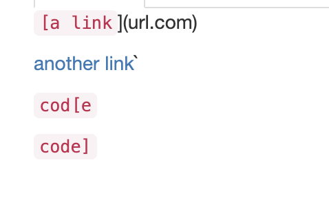

How I turned it into a test:
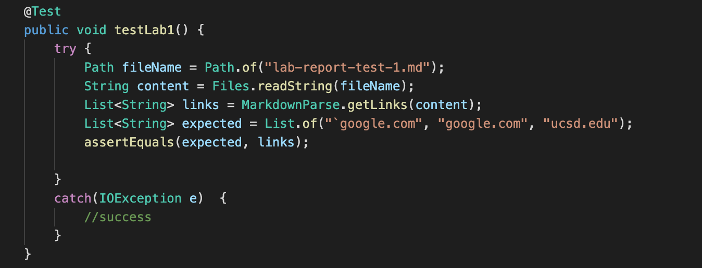

The output of the test for the reviewed MarkdownParse:
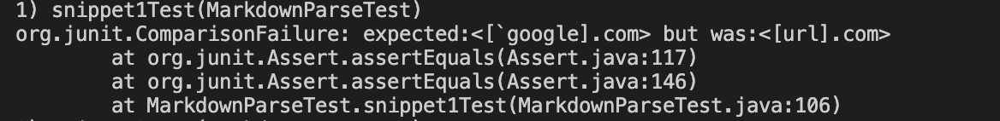

The output of the test for my MarkdownParse:
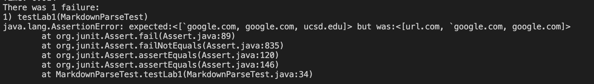

I do think there is a small code change that could fix the code with backticks. Within the while loop, I could add an if statement checking to see if there is a backtick within the file. If so, I would do several checks to see if there is another backtick and whether or not the backtick is before the first bracket.

## Snippet 2

Expected Result:
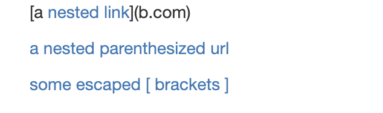

How I turned it into a test:
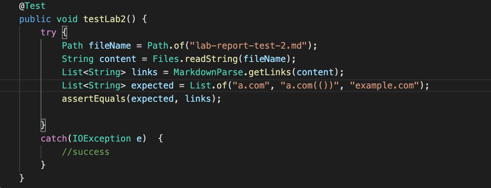

The output of the test for the reviewed MarkdownParse:
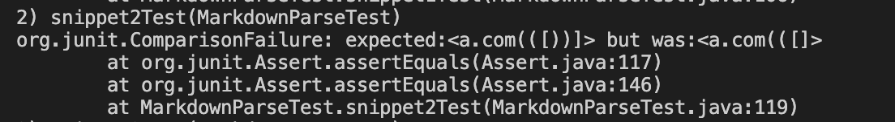

The output of the test for my MarkdownParse:
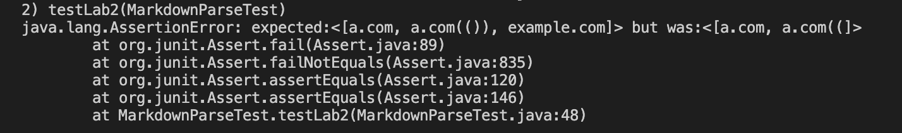

I do believe there is a small code change that could fix the code for nested items. I just have to find the last occurrence of the closing bracket and the last occurrence of the closing parentheses. 

## Snippet 3

Expected Result:
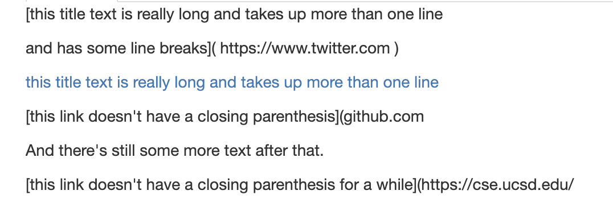

How I turned it into a test:
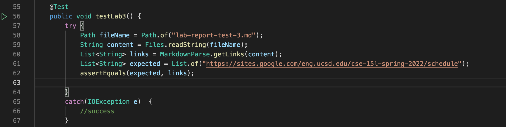

The output of the test for the reviewed MarkdownParse:
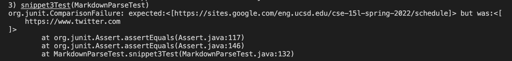

The output of the test for my MarkdownParse:
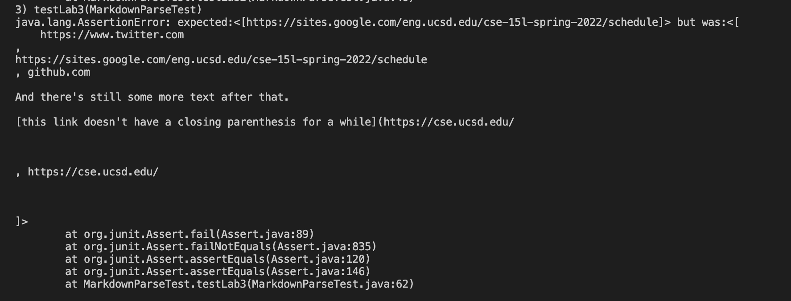

I do not believe there is a small code change that would fix newlines in brackets and parentheses. This is because you have to check many things, such as whether or not a bracket or parentheses is in a new line and whether or not a link has a closing parentheses.
