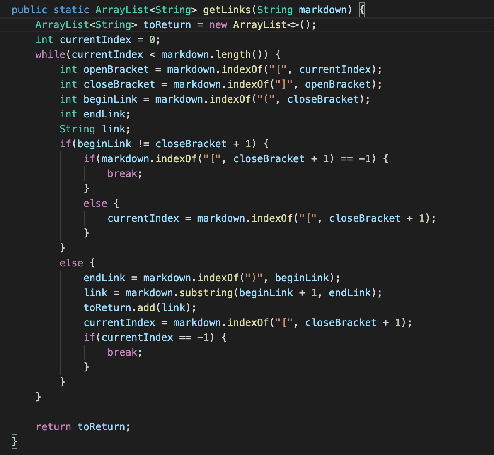

# Bug Comparing

I found the tests with different results manually, as I was unable to use `vimdiff` to compare both files despite strenuous efforts.

## [__Test 1__](https://github.com/nidhidhamnani/markdown-parser/blob/main/test-files/498.md) 

My implementation:

Lab 9's Implementation:

As seen in these screenshots, neither code was able to return the correct link, as the correct link according to [CommonMark](https://spec.commonmark.org/dingus/) was `[<foo(and(bar)>]`.

The reason my code is showing the wrong output is because it is not finding the very last parentheses of the link. Because of this, it simply finds the index of the very first parentheses, which results in a cut-off link. The code would have to be modified right after the second `else` statement, where `endLink` provides the first instance of `")"`.

## [__Test 2__](https://github.com/nidhidhamnani/markdown-parser/blob/main/test-files/41.md)

My implementation:

Lab 9's Implementation:

In these screenshots, Lab 9's code was able to return the correct link, as [CommonMark's correct link](https://spec.commonmark.org/dingus/) was `[]`.

I believe that the reason why my code doesn't show the right output is because it does not take into account of `&quot`. Since my code doesn't check this, it simply gathers everything in the parentheses and implements it as a link. The code should fix this somewhere after the `while` and before the first `if` statement. 

